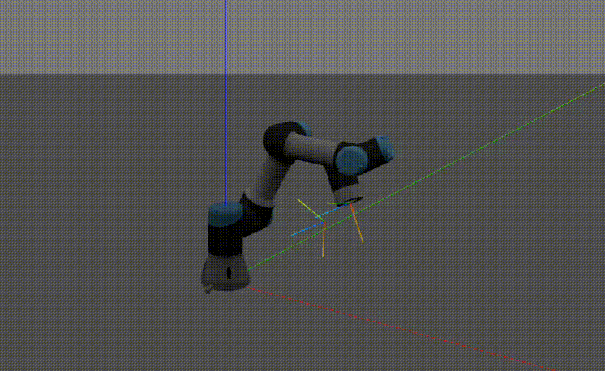
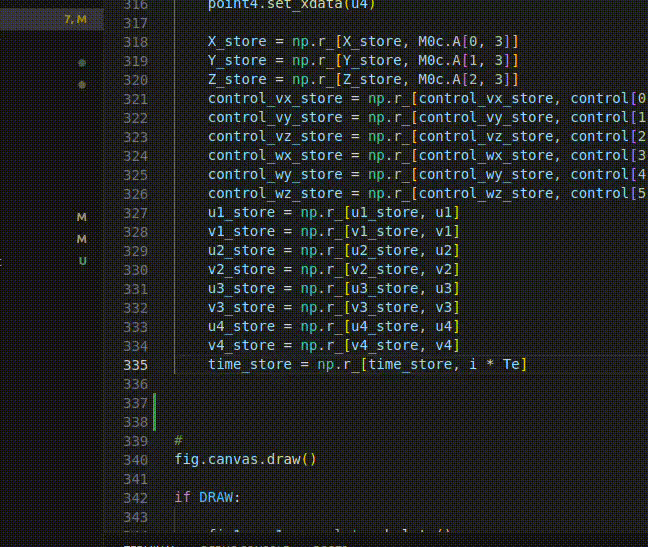

# Advanced-control-Practicals


## Création d'un environnement virtuel


1. Créer l'environnement virtuel

```bash
python3 -m venv tp_venv
source tp_venv/bin/activate
python -m pip install -r tp_requirements.txt
```

### UR3 Control

The goal of this practical is to control the UR3 robot Peter Corke's Robotics Toolbox for Python. I implemented a Proportional Controller to control the robot's end-effector position. The controller is implemented in the file `command.py`. 

I had to implement a axes-angle representation of the rotation matrix to be able to control the orientation of the end-effector. Then, I used the Jacobian to compute the joint velocities, in order to implement a velocity control.

To see more details, see report.pdf




### Visual Servoing of a 6 DoF robot

The goal of this practical is to control the UR3 robot using visual servoing. I implemented a Proportional Controller to control the robot's end-effector position. I implemented the interaction matrix to compute the joint velocities.

